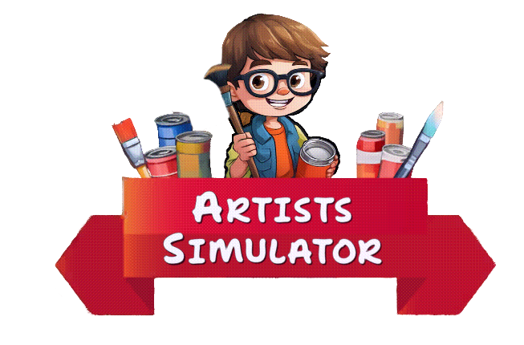

  
  <a href="#-english-version"> English Version</a>
  <a href="https://github.com/FineRace">
  

  

<h3 align="center">Привет! Я FineRace, и это — мой флагманский проект-портфолио.</h3>

  
  
  

---

  
  

---

### TL;DR
- 📱 Выпустил полноценную мобильную игру на **Google Play** (Unity, 2025).
- 🎨 Геймплей: **рисование в реальном времени** на Texture2D с AI-соперниками и **кастомным шейдером**, который делает картинку плавной и привлекательной даже при низком числе пикселей.
- 🛠️ Чистая архитектура: **Zenject (DI), FSM, SOLID, KISS, YAGNI, Addressables, асинхронное ядро**.
- 🛒 Рефакторинг внутриигрового магазина на **MVP + DI** → быстрее внедряются новые фичи, дешевле поддержка в долгосрочной перспективе.
- ✨ С помощью собственного Unity-плагина AOP сократил количество бойлерплейт-кода примерно на ~60%.
- 🧩 Создал большое количество **модульных переиспользуемых систем и сервисов**.
- 🎭 Гибкая **data-driven архитектура кастомизации персонажей** ускоряет добавление новых персонажей на ~75% и без участия программиста.
- 🚀 Оптимизация: ускорил операции с ключевой текстурой холста примерно на ~35% путём внедрения кастомного шейдера.
- 🤖 AI-Augmented Development: Внедрил AI-инструменты (Cursor IDE, Copilot) в рабочий процесс для ускорения прототипирования и сложного рефакторинга, что повысило общую скорость разработки на ~40-50%.

---

### 💡 О проекте

"Artist's Simulator" — это соревновательная игра про рисование на скорость с глубокой кастомизацией персонажа и локации. Проект построен на гибкой data-driven архитектуре (SOLID, DI, FSM), созданной для долгосрочной поддержки и дешёвого добавления нового контента. 

На практике это означает, что гейм-дизайнер может самостоятельно настраивать баланс и добавлять предметы через конфиги, не отвлекая программиста и ускоряя процесс итераций.

> [!NOTE]
> 

>   
<strong>Подробнее о проекте...</strong>

>
>    
>
>   *   **🎮 Игровой цикл (Core Loop):** Игрок входит в соревновательный матч, где ему последовательно выдаются узоры для рисования. Главная задача — максимально точно и быстро повторить узор на холсте с помощью мыши/свайпа. По окончании таймера матча или по достижении цели по очкам, результат сравнивается с результатом ИИ-соперника, и игрок получает награду.
>
>   *   **🧑‍🎨 Долгосрочная цель (Meta):** Заработанная валюта тратится в магазине на кастомизацию персонажа и обновление главной локации. Созданный уникальный образ демонстрируется во время соревновательных матчей.
>
>   *   **🎯 Цель проекта:** Создать "залипательную" мобильную игру на базе профессиональной, data-driven архитектуры. Проект является практической реализацией принципов SOLID, KISS, YAGNI и т.д, нацеленной на долгосрочную поддержку и дешёвое добавление нового контента.
>
> 

---

  
  

---

### ⚙️ Под капотом: Архитектурные решения

В основе проекта лежит связка **DI (Zenject)**, **FSM** и сервисы, где состояния FSM выступают в роли главных оркестраторов. Это обеспечивает высокую модульность и позволяет переиспользовать компоненты в разных частях игры. Для особо сложных UI-экранов, таких как магазин, используются **локальные DI-контейнеры**, создавая изолированную "мини-вселенную" зависимостей, которая живёт и умирает вместе с экраном.

> [!NOTE]
> 

>   
<strong>Показать архитектуру в действии...</strong>

>
>    
>
>   #### 1. 🧩 Поток Управления 
>
>   *  **Точка входа:** Главный загрузчик (`GameBootrapper`) инициализирует глобальный DI-контейнер и запускает `GameStateMachine`.
>   
>   *  **Загрузка (`BootState`):** Асинхронно через `UniTask` инициализирует все глобальные сервисы, загружает основную сцену и запускает `UIStateMachine`.
>   
>   *  **Разделение логики:** `GameStateMachine` управляет глобальным состоянием (в меню, в игре), а `UIStateMachine` — исключительно отображением и логикой UI, получая команды от "старшего" FSM.
>
>   ---
>
>   #### 2. 🕹️ Проверка на прочность: Добавление системы "Daily Quests"
>
>   Гибкость архитектуры позволяет легко интегрировать новую сложную систему:
>
>   *   **Шаг 1 (Данные):** Создается глобальный `QuestDataService`, который хранит информацию о доступных и выполненных квестах. Регистрируется в DI.
>
>   *   **Шаг 2 (Логика):** Создается `QuestExecutionService`. Он следит за состоянием `GameStateMachine` и, в зависимости от него (например, если мы в геймплее), активирует нужные **модули-стратегии** для проверки выполнения квестов. Например, для квеста "Потратить 500 монет" будет активна стратегия, слушающая события `CurrenciesService`, а для квеста "Нарисуй 3 узора" — стратегия, следящая за `PaintGameplayGenerationService`.
>
>   *   **Шаг 3 (Представление):** Создается UI-префаб и новое состояние `DailyQuestUIState` для `UIStateMachine`. Это состояние инициализирует меню. Доступ к `QuestDataService` получает `QuestsMenuObserver` при создании префаба меню через `.InjectGameObject` в сервисе `IAssetsService`. `QuestsMenuObserver` отображает текущие квесты и их прогресс.
>
>   **✨ Результат:** Новая система полностью модульна. Логика проверки отделена от данных и представления. Новые типы квестов добавляются простым созданием новой "стратегии", не затрагивая существующий код. Для команды это означает, что добавление нового типа квестов — это предсказуемая задача, которую можно оценить в часах, а не днях, и она не несет в себе риска сломать стабильно работающие части игры.
>
>
> 

---

### 🛠️ Реализованные модульные системы

Проект состоит из множества модульных подсистем, включая комплексную механику рисования в реальном времени, data-driven кастомизацию, асинхронное ядро на `UniTask` и собственный AOP-плагин. Каждая система спроектирована для максимальной независимости и переиспользуемости.

> [!NOTE]
> 

>   
<strong>Показать полный список систем...</strong>

>
>    
>
>   #### I. Core Gameplay Systems
>
>   *   **✍️ Система Рисования и Оценки Точности**
>       *   **Ответственные классы:** `PaintingService`, `PaintExecutionService`, `PaintAccuracyService`, `BrushControlService`.
>       *   **Суть:** Комплекс систем, отвечающий за отрисовку мазков на `Texture2D` в реальном времени, управление движением 3D-кисти и сложный расчет точности попадания в контур.
>           

>           
<strong>🧠 Особенности реализации...</strong>

>         	Самой сложной задачей была реализация математики кривых и их корректная проекция на 3D-холст. Главным достижением стала оптимизация: чтобы избежать пикселизации при низком разрешении холста, был интегрирован кастомный шейдер сглаживания и размытия. Это позволило добиться высокого качества картинки при минимальных затратах производительности.
>           

>
>   *   **🗺️ Система Инструкций и Вариативности**
>       *   **Ответственные классы:** `PathGenerationService`, `PaintPath`.
>       *   **Суть:** Отвечает за выбор, загрузку и размещение на холсте заранее созданных путей-инструкций для рисования. Для повышения реиграбельности к каждой инструкции применяются случайные трансформации (поворот, отражение).
>
>   *   **🤖 Система Адаптивного ИИ-соперника**
>       *   **Ответственные классы:** `PseudoEnemyService`, `CompetitiveGameConfig`.
>       *   **Суть:** Имитирует действия соперника в матче. Скорость и точность ИИ полностью настраиваются через `ScriptableObject`-конфиг и динамически адаптируются к уровню игрока и прогрессу внутри матча, создавая органичный и гибкий челлендж.
> 
> ---
> 
>   #### II. Meta & Progression Systems
>
>   *   **🧑‍🎨 Система Кастомизации Персонажа**
>       *   **Ответственные классы:** `CharactersServiceFacade`, `CharacterCustomizationView`, `ObjectSlotReference`, `MaterialSlotReference`, `HairSlotReference`, `CharacterItemData`.
>       *   **Суть:** Data-driven система, позволяющая гибко настраивать внешний вид персонажа путем применения различных типов предметов (`Object`, `Material`, `Hair`) к слотам.
>           

>           
<strong>🧠 Особенности реализации...</strong>

>           Главное достижение — абсолютная модульность. Система позволяет создавать любых персонажей без единой строчки кода, имея лишь ассеты. Архитектура слотов настолько гибкая, что позволяет легко расширять ее новыми типами (например, добавить слот "фрактала" или любой другой), что дает безграничные возможности для кастомизации. UI магазина построен на MVP-паттерне, что позволяет полностью отделить логику от визуального представления.
>           

>
>   *   **🏡 Система Улучшений Локации**
>       *   **Ответственные классы:** `LocationImprovementsService`, `LocationImprovementItemData`.
>       *   **Суть:** Позволяет игроку за валюту покупать и отображать на главной локации косметические улучшения, визуализируя свой прогресс.
>
>   *   **💰 Экономика и Уровень Игрока**
>       *   **Ответственные классы:** `CurrenciesService`, `PlayerLevelService`.
>       *   **Суть:** Управляет внутриигровыми валютами и системой опыта/уровней, которая влияет на сложность ИИ и награды.
>
> ---
>
>   #### III. Architectural & Core Systems
>
>   *   **🏛️ Архитектурный каркас (DI & FSM)**
>       *   **Ответственные классы:** `GameStateMachine`, `UIStateMachine`, `BootState`, `ShopInstaller` (пример `GameObjectContext`).
>       *   **Суть:** Фундамент проекта. Два конечных автомата управляют глобальным состоянием и состоянием UI, а Dependency Injection (Zenject) связывает все системы через интерфейсы.
>
>   *   **🚀 Асинхронное Ядро**
>       *   **Ответственные классы:** `AssetsService`, `BootState` (пример использования `UniTask`).
>       *   **Суть:** Все "тяжелые" операции (загрузка ассетов, сцен, UI) выполняются асинхронно через `UniTask` и `Addressable Assets System`, что обеспечивает плавную работу приложения без фризов.
>
> 
>   *   **💾 Система Сохранений**
>       *   **Ответственные классы:** `MobileSaveLoadService`.
>       *   **Суть:** Отвечает за сохранение всего прогресса игрока. Ключевая особенность — **debounce-механизм**, который группирует частые вызовы сохранения (например, при каждом изменении в кастоми-ации) в один, предотвращая излишнюю нагрузку на систему.
>
>   *   **✨ Метапрограммирование (AOP)**
>       *   **Ответственные классы:** `MagicAttributes.cs` (`[LogMethod]`, `[SafeAnimation]`).
>       *   **Суть:** С помощью **[собственного open-source плагина](https://github.com/finerace/MethodBoundaryAspect.Fody-for-Unity)** в код на этапе компиляции автоматически добавляется дополнительная логика (логирование, безопасная обработка исключений в анимациях), что делает основную кодовую базу чище и сокращает количество шаблонного кода.
>
> --- 
>
>   #### IV. Supporting & Utility Systems
>
>   *   **🎧 Аудио-система**
>       *   **Ответственные классы:** `AudioPoolService`.
>       *   **Суть:** Управляет воспроизведением всех звуков. Использует **пул объектов** для `AudioSource`, чтобы избежать постоянного создания и уничтожения объектов, что положительно сказывается на производительности.
>
>   *   **⚙️ Система Конфигурации (Data-Driven Design)**
>       *   **Ответственные классы:** `ConfigsProxy`, все классы в папке `Configs`.
>       *   **Суть:** Централизованный доступ ко всем настройкам игры через `ScriptableObject`-конфиги. Позволяет изменять баланс, добавлять предметы, настраивать анимации и многое другое без изменения кода.
>
>   *   **🌍 Система Локализации**
>       *   **Ответственные классы:** `LocalizationService`, `TextLocalizer`, `LocalizationConfig`.
>       *   **Суть:** Позволяет переводить весь текст в игре на разные языки, подгружая данные из текстовых файлов.
>
>   *   **🔧 Инструменты для Редактора**
>       *   **Ответственные классы:** `CharacterCustomizationViewEditor`, `LocalizationKeysGenerator`.
>       *   **Суть:** Набор кастомных инспекторов для редактора Unity, которые упрощают и ускоряют процесс настройки контента (например, автоматическая генерация слотов для кастомизации на основе `ScriptableObject`-шаблона).
>
> 

---

  
  

---

### 🚀 От Монолита к Модульности: Кейс-стади

В проекте была полностью переработана монолитная система UI магазина кастомизации. В результате рефакторинга сложный "God Object" был декомпозирован на независимые, тестируемые компоненты по паттерну MVP с использованием DI. Этот процесс демонстрирует практическое применение принципов SOLID для создания поддерживаемой и масштабируемой архитектуры.

> [!NOTE]
> 

> 
<strong>Показать полный отчет о рефакторинге...</strong>

> 
> # 📝 Рефакторинг системы меню кастомизации персонажа
> 
> ## 1. 🧐 Исходная архитектура: Проблемы и достоинства
> 
> Изначально вся логика системы была сконцентрирована в двух основных классах-монолитах: `CharacterCustomisationShopViewDEBUG.cs` и `ShopCellViewDEBUG.cs`. Такой подход имел как свои плюсы, так и существенные минусы.
> 
> ### 1.1. 🟢 Достоинства
> 
> *   ✅ **Централизация логики**: Практически вся логика находилась в одном месте, что упрощало поиск багов — не было нужды "прыгать" по десяткам файлов.
> *   👍 **Минимум кода оркестрации**: Единый центр управления требовал минимальной обвязки и менеджмент-логики.
> *   ✨ **Воспринимаемая простота**: На первый взгляд, код казался простым, так как не требовал изучения множества классов и их взаимодействий.
> *   🚀 **Начальная простота расширения**: Добавление новой функциональности на ранних этапах было относительно простым.
> 
> ### 1.2. 🔴 Недостатки
> 
> *   😟 **Сложность понимания**: Взаимосвязи между многочисленными компонентами внутри одного класса были запутанными и неочевидмыми.
> *   ❌ **Невозможность тестирования**: "Божественный объект" (God Object) практически невозможно покрыть unit-тестами.
> *   ⛓️ **Высокая связанность (High Coupling)**: Ошибка в одном из компонентов могла привести к отказу всей системы.
> *   📈 **Экспоненциальный рост сложности**: Каждое новое изменение или расширение делало класс всё более сложным и неповоротливым.
> *   🔄 **Нулевая переиспользуемость**: Использовать класс или его отдельные части в других системах или проектах было невозможно.
> *   🔥 **Сложность поддержки**: Поддерживать и исправлять ошибки в таком коде становилось всё труднее.
> 
> ### 1.3. 🤔 Вывод
> 
> Необходимость рефакторинга была спорной и зависела от планов на развитие проекта:
> *   Если система не требовала бы доработок, её можно было оставить "как есть".
> *   👉 Однако, при планах на расширение, изменение или переиспользование компонентов, рефакторинг становился не просто желательным, а **необходимым**. Расширять текущую архитектуру — всё равно что стрелять себе в ногу.
> 
> ### 1.4. 🎯 Итог решения
> 
> Было принято решение провести рефакторинг. Основные мотивы:
> 1.  **Планы по переиспользованию**: Возможность использовать данную систему в будущих проектах.
> 2.  **Практика**: Отличная возможность отточить навыки декомпозиции, проектирования и применения фундаментальных принципов программирования.
> 
> ---
> 
> ## 2. 🏗️ Рефакторинг, Фаза 1: Переход к MVP
> 
> В качестве целевого архитектурного паттерна был выбран **MVP (Model-View-Presenter)**. Он идеально подходил для задачи благодаря слабой связанности компонентов и возможности их изоляции.
> 
> ### 2.1. MODEL (Данные) 📦
> 
> Модель данных уже частично существовала (`CharacterItemData.cs`, конфиги, ScriptableObjects). Однако, логика по работе с данными (например, фильтрация) была "зашита" во View. Был выделен отдельный провайдер:
> *   `ItemsProvider.cs`: Инкапсулировал логику фильтрации и предоставления предметов.
> 
> ### 2.2. VIEW (Отображение) 🖼️
> 
> Представление было выделено на основе существующего `CharacterCustomisationShopPanelManager.cs` и `ShopCellViewDEBUG.cs`:
> *   `ICharacterItemsShopView.cs` / `CharacterItemsShopView.cs`: "Глупый" View, отвечающий только за отображение UI элементов магазина (панели, кнопки, цены).
> *   `IShopCellView.cs` / `ShopCellView.cs`: View отдельной ячейки, отвечающий за её отображение и анимации.
> 
> ### 2.3. PRESENTER (Логика) 🧠
> 
> Вся управляющая логика была вынесена в Presenter, а создание ячеек делегировано отдельной фабрике:
> *   `ShopPresenterDEBUG2.cs`: Первый вариант Presenter'а, который оркестрировал взаимодействие Model и View.
> *   `IShopCellsFabric.cs` / `ShopCellsFabric.cs`: Фабрика, ответственная за создание и уничтожение View ячеек.
> 
> ### 2.4. 🧩 Прочие улучшения
> 
> *   **Интерфейсы**: Все ключевые компоненты системы были покрыты интерфейсами (`ICharacterItemsShopView`, `IShopCellView`, `IShopCellsFabric` и т.д.) для обеспечения слабой связанности и возможности подмены зависимостей.
> *   `IColorSelectWidget.cs` / `ColorSelector.cs`: Виджет выбора цвета был вынесен за интерфейс, чтобы абстрагироваться от конкретной реализации.
> *   `ILayoutManager.cs` / `GridLayoutManager.cs`: Математическая логика расчёта позиций ячеек в сетке была вынесена в отдельный Utility-класс, что позволяет легко менять алгоритм расположения.
> 
> ### 2.5. ✅ Итоги Фазы 1
> 
> Архитектура стала значительно более устойчивой, тестируемой и гибкой. Появилась возможность переиспользовать отдельные компоненты. Однако, `ShopPresenterDEBUG2.cs` всё ещё оставался слишком большим и сложным, нарушая Принцип единственной ответственности (SRP).
> 
> ---
> 
> ## 3. 🔪 Рефакторинг, Фаза 2: Декомпозиция и DI
> 
> Основная цель второго этапа — декомпозиция монолитного `ShopPresenterDEBUG2.cs` и сборка новой архитектуры с помощью Dependency Injection.
> 
> ### 3.1. `ShopCellsPresenter.cs`
> 
> *   **Ответственность**: Управление жизненным циклом ячеек. 🏗️ Построение, перестроение и уничтожение сетки ячеек. Обновление состояния `View` ячеек.
> *   **Интерфейс**: `IShopCellsPresenter.cs`
> 
> ### 3.2. `ShopItemsSelectionPresenter.cs`
> 
> *   **Ответственность**: Логика выбора и применения предметов на персонажа. 🎨 Взаимодействие с сервисами для разблокировки и покраски предметов. Хранение временного состояния персонажа.
> *   **Интерфейс**: `IShopItemsSelectionPresenter.cs`
> 
> ### 3.3. `ShopPresenter.cs`
> 
> *   **Ответственность**: Новый главный Presenter, который выступает в роли дирижёра. 🎶 Он связывает `ShopCellsPresenter` и `ShopItemsSelectionPresenter`, управляет общей логикой навигации по категориям (пакам предметов) и жизненным циклом всего магазина.
> *   **Интерфейс**: `IShopPresenter.cs`
> 
> ### 3.4. `ShopInstaller.cs` и Dependency Injection 💉
> 
> *   **Ответственность**: Это — клей, который всё соединяет! В `ShopInstaller.cs` с помощью Zenject все новые, независимые компоненты (`Presenters`, `Views`, `Services`, `Fabrics`) связываются друг с другом через их интерфейсы. Это устраняет необходимость создавать объекты вручную и позволяет легко подменять реализации, что критически важно для тестов и гибкости.
> 
> ---
> 
> ## 4. 🎉 Итоги рефакторинга
> 
> В результате двухэтапного рефакторинга система была полностью переработана.
> 
> *   **Гибкость и расширяемость**: Новую функциональность теперь можно добавлять, не боясь сломать существующую. Компоненты легко заменить благодаря интерфейсам и централизованной настройке в DI-контейнере.
> *   **Тестируемость**: Каждый Presenter можно протестировать в изоляции, подменив зависимости на mock-объекты в DI-контейнере.
> *   **Переиспользуемость**: Компоненты (особенно `Cells`, `LayoutManager`) теперь можно легко использовать в других проектах.
> *   **Читаемость и поддержка**: Код стал чище, а каждая часть системы имеет чётко определённую зону ответственности, что значительно упрощает его понимание и поддержку.
> 
> Таким образом, время, изначально вложенное в рефакторинг, многократно окупается за счет радикального снижения стоимости поддержки и ускорения разработки нового функционала для магазина.
> Небольшое увеличение количества кода оркестрации — это оправданная цена за надёжную, масштабируемую и профессиональную архитектуру, построенную с учётом принципов SOLID. 💪
> 
> 
> ## 5. 🤔 Компромиссы и Точки Роста
> * **Принцип Единственной Ответственности (SRP)**: В финальной версии ShopPresenter все еще совмещает несколько ролей (оркестрация, управление навигацией). Это было осознанным компромиссом, чтобы избежать излишнего усложнения архитектуры и "взрыва классов". В будущем, при добавлении более сложной логики, этот класс может быть дополнительно декомпозирован.
>
> * В процессе я столкнулся с тем, что Presenter'ы всё равно вышли довольно большими, и содержат лишнюю там логику подготовки данных для View. Ретроспективно смотря на эту проблему я понимаю, что в данном случае тут лучше бы подошёл MVVM паттерн, пусть UI бы реагировал на чистые данные без каких-либо лишних заморочек и слияния с бизнес-логикой, с этим подходом можно бы было гораздо проще разделить бизнес-логику UI, и что самое главное, полностью отделить её от представления. Это был бы более чистый, а следовательно правильны подход.
>
> * **Тесты**: Архитектура подготовлена для юнит-тестирования, однако сами тесты еще не написаны. Это является следующей точкой роста для повышения надежности системы.
>
>
> 

---

### 📈 Точки Роста и План по Улучшению

Проект является крепким фундаментом, но, как и любая система, имеет потенциал для дальнейшего улучшения. Ключевые точки роста лежат в области оптимизации DI-графа, внедрения ленивой инициализации сервисов и дальнейшего рефакторинга утилитного кода.

> [!NOTE]
> 

>   
<strong>Показать некоторые из возможных улучшений...</strong>

>
>    
>
>   *   **1. Рефакторинг `ConfigsProxy`**
>       *   **Наблюдение:** В текущей реализации `ConfigsProxy` предоставляет статический доступ к `ScriptableObject`-конфигам, что является формой синглтона.
>       *   **Потенциальный риск:** Это усложняет юнит-тестирование классов, которые от него зависят, так как подменить конфиги на mock-объекты становится сложнее.
>       *   **План улучшения:** Перевести `ConfigsProxy` в разряд обычного сервиса (`IConfigService`), который будет внедряться через DI. Это сделает зависимости явными и упростит тестирование, полностью соответствуя принципам чистой архитектуры.
>
>   *   **2. Устранение Технического Долга (Decomposition & Separation of Concerns)**
>       *   **Наблюдение:** В проекте присутствуют участки легаси-кода, требующие рефакторинга. Некоторые классы (например, `PaintAccuracyService`, `PathGenerationService`) нарушают принцип SRP, смешивая сложную бизнес-логику, расчеты и прямое управление представлением (View/Transform).
>       *   **Потенциальный риск:** Высокая связность (High Coupling) и сложность (Cognitive Complexity) таких классов затрудняют их поддержку, расширение и покрытие юнит-тестами.
>       *   **План улучшения:** Декомпозировать "тяжелые" сервисы, выделив алгоритмы и расчеты в отдельные независимые классы (Стратегии/Провайдеры). Строго разграничить слои: полностью убрать работу с Unity API (позиционирование, физика) из слоя Сервисов, делегировав это специализированным View-контроллерам.
>  
>   *   **3. Ленивая инициализация сервисов (Lazy Initialization)**
>       *   **Наблюдение:** Большинство глобальных сервисов инициализируются на старте приложения в `BootState`.
>       *   **Потенциальный риск:** В действительно большой игре это может увеличить время первоначальной загрузки и начальное потребление памяти.
>       *   **План улучшения:** Внедрить фабрики или `Lazy<>` обертки для сервисов, которые не требуются на старте (например, геймплейные). Это позволит инициализировать их только в тот момент, когда они действительно понадобятся (например, при входе в `GamePlayState`).
>
>   *   **4. Улучшение структуры папок**
>       *   **Наблюдение:** Текущая иерархия папок функциональна, но могла бы быть строже структурирована.
>       *   **Потенциальный риск:** В большой команде это может привести к разночтениям и замедлить поиск нужных ассетов и скриптов.
>       *   **План улучшения:** Реорганизовать структуру по принципу "Feature Slices" (группировка по фичам), где весь код, префабы и ассеты, относящиеся к одной фиче (например, "Кастомизация"), лежат в одной папке. Это повысит навигацию и инкапсуляцию.
>
>   *   **5. Рефакторинг утилитного кода**
>       *   **Наблюдение:** Некоторые утилитные классы (например, `AuxiliaryFunc.cs`) содержат большое количество методов-расширений, часть из которых была сгенерирована с помощью ИИ.
>       *   **Потенциальный риск:** Это может привести к "раздуванию" класса и усложнению его поддержки.
>       *   **План улучшения:** Разделить монолитный утилитный класс на несколько более мелких и сфокусированных (например, `VectorExtensions`, `UIAnimationExtensions`, `MathExtensions`), чтобы каждый отвечал за свою, четко определенную зону ответственности.
>
>   *   **6. Покрытие юнит-тестами**
>       *   **Наблюдение:** Архитектура (DI, интерфейсы, FSM) полностью подготовлена для юнит-тестирования, но сами тесты еще не написаны.
>       *   **Потенциальный риск:** Отсутствие тестов повышает риск регрессионных ошибок при добавлении нового функционала.
>       *   **План улучшения:** Написать набор юнит-тестов для ключевых сервисов (например, `CurrenciesService`, `PaintAccuracyService`), чтобы гарантировать их корректную работу и повысить общую стабильность проекта.
>
>   *   **7. Разделение UI-состояний и Игровой логики**
>   *   **Наблюдение:** В текущей реализации состояние магазина (`CharacterCustomisationMenuUIState.cs`) в `UIStateMachine` не только управляет отображением UI, но и выступает оркестратором для бизнес-логики покупок.
>   *   **Потенциальный риск:** Это является небольшим нарушением Принципа единственной ответственности, так как `UIStateMachine` начинает знать о геймплейной логике. В более крупном проекте это может привести к усложнению FSM.
>   *   **План улучшения:** В следующей итерации можно было бы вынести управление логикой магазина в более высоко-ровневый `GameStateMachine`. Его состояние отвечало бы за активацию логики, а `UIStateMachine` получал бы от него лишь команду "показать/скрыть UI магазина". Это обеспечило бы полное разделение логики и представления на уровне состояний.
>
> 

---
<h3 align="center">Спасибо за внимание!! Связь:</h3>

  
  

 
 
 
 
 
 
 
 
 
 
 
 
 
 

##  English Version

  
  <a href="#привет-я-finerace-и-это--мой-флагманский-проект-портфолио">Русская версия</a>
  <a href="https://github.com/FineRace">
  

  

<h3 align="center">Hi! I'm FineRace, and this is my flagship portfolio project.</h3>

  
  
  

---

  
  

---

### TL;DR
- 📱 Released a full mobile game on **Google Play** (Unity, 2025).
- 🎨 Core gameplay: **real-time drawing mechanics** on Texture2D with AI opponents and a **custom shader** for smooth visuals, even with low pixel counts.
- 🛠️ Clean architecture: **Zenject (DI), FSM, SOLID, async core**.
- 🛒 Refactored in-game store using **MVP + DI** → faster feature delivery and cheaper long-term maintenance.
- ✨ Reduced boilerplate code by ~60% using my own AOP Unity plugin.
- 🧩 Built a large set of **modular, reusable systems and services**.
- 🎭 Flexible **data-driven character customization** system → +75% faster to add new characters, no programmer involvement required.
- 🚀 Optimizations: improved key-texture operations performance by ~35%.
- 🤖 AI-Augmented Development: Boosted development speed by ~40-50% by integrating AI tools (Cursor IDE, Copilot) to accelerate prototyping and complex refactoring.

---

### 💡 About the Project

"Artist's Simulator" is a competitive speed-painting game featuring deep character and location customization. The project is built on a flexible, data-driven architecture (SOLID, DI, FSM) designed for long-term support and cost-effective content updates. 

In practice, this means a game designer can independently adjust the balance and add new items using configs, freeing up programmers and significantly speeding up the iteration cycle.

> [!NOTE]
> 

>   
<strong>Learn more about the project...</strong>

>
>    
>
>   *   **🎮 Core Loop:** The player enters a competitive match where they are sequentially given patterns to draw. The main objective is to replicate the pattern on the canvas as accurately and quickly as possible using a mouse or swipe gestures. When the match timer ends or the score target is reached, the player's result is compared to an AI opponent's score, and the player receives a reward.
>
>   *   **🧑‍🎨 Meta Gameplay:** The earned currency is spent in the shop to customize the character and upgrade the main location. The player's unique appearance is then showcased during competitive matches.
>
>   *   **🎯 Project Goal:** To create an engaging mobile game based on a professional, data-driven architecture. This project is a practical implementation of principles like SOLID, KISS, and YAGNI, aimed at ensuring long-term maintainability and low-cost content additions.
>
> 

---

  
  

---

### ⚙️ Under the Hood: Architectural Decisions

The project's core is a combination of **DI (Zenject)**, **FSM**, and services, where FSM states act as the main orchestrators. This ensures high modularity and allows for the reuse of components across different parts of the game. For particularly complex UI screens, such as the shop, **local DI containers** are used to create an isolated "mini-universe" of dependencies that lives and dies with the screen.

> [!NOTE]
> 

>   
<strong>See the architecture in action...</strong>

>
>    
>
>   #### 1. 🧩 Control Flow 
>
>   *  **Entry Point:** The main `GameBootrapper` initializes the global DI container and starts the `GameStateMachine`.
>   
>   *  **Loading (`BootState`):** Asynchronously initializes all global services via `UniTask`, loads the main scene, and starts the `UIStateMachine`.
>   
>   *  **Separation of Concerns:** The `GameStateMachine` manages the global state (e.g., in menu, in game), while the `UIStateMachine` exclusively handles UI display and logic, receiving commands from the "parent" FSM.
>
>   ---
>
>   #### 2. 🕹️ Stress Test: Adding a "Daily Quests" System
>
>   The architecture's flexibility allows for the easy integration of a new complex system:
>
>   *   **Step 1 (Data):** A global `QuestDataService` is created to store information about available and completed quests. It is registered in the DI container.
>
>   *   **Step 2 (Logic):** A `QuestExecutionService` is created. It monitors the state of the `GameStateMachine` and, depending on the current state (e.g., if we are in gameplay), activates the appropriate **strategy modules** to check for quest completion. For instance, a quest like "Spend 500 coins" would activate a strategy that listens to events from `CurrenciesService`, while a quest like "Draw 3 patterns" would use a strategy that tracks `PaintGameplayGenerationService`.
>
>   *   **Step 3 (Presentation):** A UI prefab and a new `DailyQuestUIState` are created for the `UIStateMachine`. This state initializes the menu. A `QuestsMenuObserver` gains access to `QuestDataService` when the menu prefab is instantiated via `.InjectGameObject` in the `IAssetsService`. The `QuestsMenuObserver` then displays the current quests and their progress.
>
>   **✨ Result:** The new system is completely modular. The validation logic is decoupled from the data and the presentation layers. New quest types can be added simply by creating a new "strategy" without touching any existing code. For the team, this translates to a predictable task that can be estimated in hours instead of days, with minimal risk of introducing regressions to stable parts of the game.
>
>
> 

---

### 🛠️ Implemented Modular Systems

The project consists of numerous modular subsystems, including a complex real-time drawing mechanic, data-driven customization, an asynchronous core powered by `UniTask`, and a custom AOP plugin. Each system is designed for maximum independence and reusability.

> [!NOTE]
> 

>   
<strong>Show the full list of systems...</strong>

>
>    
>
>   #### I. Core Gameplay Systems
>
>   *   **✍️ Drawing and Accuracy Evaluation System**
>       *   **Responsible Classes:** `PaintingService`, `PaintExecutionService`, `PaintAccuracyService`, `BrushControlService`.
>       *   **Essence:** A complex of systems responsible for rendering strokes on a `Texture2D` in real-time, managing the movement of a 3D brush, and performing a sophisticated calculation of how accurately the stroke follows the outline.
>           

>           
<strong>🧠 Implementation Highlights...</strong>

>         	The most challenging task was implementing the curve mathematics and their correct projection onto a 3D canvas. The key achievement was optimization: to avoid pixelation on a low-resolution canvas, a custom anti-aliasing and blur shader was integrated. This delivered high-quality visuals with minimal performance overhead.
>           

>
>   *   **🗺️ Instructions and Variability System**
>       *   **Responsible Classes:** `PathGenerationService`, `PaintPath`.
>       *   **Essence:** Responsible for selecting, loading, and placing pre-made drawing instruction paths onto the canvas. To enhance replayability, random transformations (rotation, reflection) are applied to each instruction.
>
>   *   **🤖 Adaptive AI Opponent System**
>       *   **Responsible Classes:** `PseudoEnemyService`, `CompetitiveGameConfig`.
>       *   **Essence:** Simulates an opponent's actions during a match. The AI's speed and accuracy are fully configurable via a `ScriptableObject` config and dynamically adapt to the player's skill level and in-match progress, creating an organic and flexible challenge.
> 
> ---
> 
>   #### II. Meta & Progression Systems
>
>   *   **🧑‍🎨 Character Customization System**
>       *   **Responsible Classes:** `CharactersServiceFacade`, `CharacterCustomizationView`, `ObjectSlotReference`, `MaterialSlotReference`, `HairSlotReference`, `CharacterItemData`.
>       *   **Essence:** A data-driven system that allows for flexible character appearance customization by applying different types of items (`Object`, `Material`, `Hair`) to various slots.
>           

>           
<strong>🧠 Implementation Highlights...</strong>

>           The main achievement is its absolute modularity. The system allows creating any character without a single line of code, using only assets. The slot architecture is so flexible that it can be easily extended with new types (e.g., adding a "fractal" slot or any other), providing limitless customization possibilities. The shop UI is built on the MVP pattern, completely decoupling logic from visual presentation.
>           

>
>   *   **🏡 Location Improvement System**
>       *   **Responsible Classes:** `LocationImprovementsService`, `LocationImprovementItemData`.
>       *   **Essence:** Allows the player to spend currency to purchase and display cosmetic upgrades in the main location, visualizing their progress.
>
>   *   **💰 Economy and Player Level System**
>       *   **Responsible Classes:** `CurrenciesService`, `PlayerLevelService`.
>       *   **Essence:** Manages in-game currencies and the experience/level system, which affects AI difficulty and rewards.
>
> ---
>
>   #### III. Architectural & Core Systems
>
>   *   **🏛️ Architectural Framework (DI & FSM)**
>       *   **Responsible Classes:** `GameStateMachine`, `UIStateMachine`, `BootState`, `ShopInstaller` (example of `GameObjectContext`).
>       *   **Essence:** The project's foundation. Two finite-state machines manage the global and UI states, while Dependency Injection (Zenject) connects all systems through interfaces.
>
>   *   **🚀 Asynchronous Core**
>       *   **Responsible Classes:** `AssetsService`, `BootState` (example of `UniTask` usage).
>       *   **Essence:** All "heavy" operations (loading assets, scenes, UI) are performed asynchronously using `UniTask` and the `Addressable Assets System`, ensuring a smooth, freeze-free application experience.
>
> 
>   *   **💾 Save System**
>       *   **Responsible Classes:** `MobileSaveLoadService`.
>       *   **Essence:** Responsible for saving all player progress. A key feature is its **debounce mechanism**, which groups frequent save calls (e.g., on every customization change) into a single call, preventing excessive system load.
>
>   *   **✨ Metaprogramming (AOP)**
>       *   **Responsible Classes:** `MagicAttributes.cs` (`[LogMethod]`, `[SafeAnimation]`).
>       *   **Essence:** Using a **[custom open-source plugin](https://github.com/finerace/MethodBoundaryAspect.Fody-for-Unity)**, additional logic (logging, safe exception handling in animations) is automatically woven into the code at compile time. This keeps the main codebase cleaner and reduces boilerplate.
>
> --- 
>
>   #### IV. Supporting & Utility Systems
>
>   *   **🎧 Audio System**
>       *   **Responsible Classes:** `AudioPoolService`.
>       *   **Essence:** Manages all sound playback. It uses an **object pool** for `AudioSource` components to avoid constant instantiation and destruction, which improves performance.
>
>   *   **⚙️ Configuration System (Data-Driven Design)**
>       *   **Responsible Classes:** `ConfigsProxy`, all classes in the `Configs` folder.
>       *   **Essence:** Provides centralized access to all game settings via `ScriptableObject` configs. This allows for changes to game balance, item additions, animation tweaks, and more without modifying the code.
>
>   *   **🌍 Localization System**
>       *   **Responsible Classes:** `LocalizationService`, `TextLocalizer`, `LocalizationConfig`.
>       *   **Essence:** Enables translation of all in-game text into different languages by loading data from text files.
>
>   *   **🔧 Editor Tools**
>       *   **Responsible Classes:** `CharacterCustomizationViewEditor`, `LocalizationKeysGenerator`.
>       *   **Essence:** A set of custom inspectors for the Unity Editor that simplify and accelerate the content setup process (e.g., auto-generating customization slots based on a `ScriptableObject` template).
>
> 

---

  
  

---

### 🚀 From Monolith to Modularity: A Case Study

The project's monolithic character customization shop UI was completely overhauled. Through refactoring, a complex "God Object" was decomposed into independent, testable components following the MVP pattern with Dependency Injection. This process demonstrates the practical application of SOLID principles to create a maintainable and scalable architecture.

> [!NOTE]
> 

> 
<strong>Show the full refactoring report...</strong>

> 
> # 📝 Refactoring the Character Customization Menu
> 
> ## 1. 🧐 Initial Architecture: Problems and Merits
> 
> Originally, all system logic was concentrated in two monolithic classes: `CharacterCustomisationShopViewDEBUG.cs` and `ShopCellViewDEBUG.cs`. This approach had both its advantages and significant drawbacks.
> 
> ### 1.1. 🟢 Merits
> 
> *   ✅ **Centralized Logic**: Nearly all logic was in one place, which simplified bug hunting—no need to jump between dozens of files.
> *   👍 **Minimal Orchestration Code**: A single control center required minimal boilerplate and management logic.
> *   ✨ **Perceived Simplicity**: At first glance, the code seemed straightforward as it didn't require understanding numerous classes and their interactions.
> *   🚀 **Initial Ease of Extension**: Adding new functionality was relatively simple in the early stages.
> 
> ### 1.2. 🔴 Drawbacks
> 
> *   😟 **Difficult to Understand**: The relationships between numerous components within a single class were tangled and non-obvious.
> *   ❌ **Untestable**: A "God Object" is nearly impossible to cover with unit tests.
> *   ⛓️ **High Coupling**: An error in one component could cause the entire system to fail.
> *   📈 **Exponential Complexity Growth**: Each new change or feature made the class increasingly complex and unwieldy.
> *   🔄 **Zero Reusability**: Using the class or its parts in other systems or projects was impossible.
> *   🔥 **Difficult to Maintain**: Maintaining and fixing bugs in such code became progressively harder.
> 
> ### 1.3. 🤔 Conclusion
> 
> The need for refactoring was debatable and depended on the project's future development plans:
> *   If the system required no further modifications, it could have been left "as is."
> *   👉 However, with plans for extension, modification, or reuse of components, refactoring became not just desirable, but **essential**. Extending the existing architecture would be like shooting yourself in the foot.
> 
> ### 1.4. 🎯 Final Decision
> 
> The decision was made to refactor. The primary motivations were:
> 1.  **Reuse Plans**: The ability to use this system in future projects.
> 2.  **Practice**: An excellent opportunity to hone skills in decomposition, design, and the application of fundamental programming principles.
> 
> ---
> 
> ## 2. 🏗️ Refactoring, Phase 1: Transition to MVP
> 
> **MVP (Model-View-Presenter)** was chosen as the target architectural pattern. It was ideal for the task due to the low coupling of its components and their potential for isolation.
> 
> ### 2.1. MODEL 📦
> 
> The data model already partially existed (`CharacterItemData.cs`, configs, ScriptableObjects). However, the data handling logic (e.g., filtering) was hard-coded into the View. A separate provider was extracted:
> *   `ItemsProvider.cs`: Encapsulated the logic for filtering and providing items.
> 
> ### 2.2. VIEW 🖼️
> 
> The View was extracted from the existing `CharacterCustomisationShopPanelManager.cs` and `ShopCellViewDEBUG.cs`:
> *   `ICharacterItemsShopView.cs` / `CharacterItemsShopView.cs`: A "dumb" View responsible only for displaying shop UI elements (panels, buttons, prices).
> *   `IShopCellView.cs` / `ShopCellView.cs`: The View for an individual cell, responsible for its display and animations.
> 
> ### 2.3. PRESENTER 🧠
> 
> All controlling logic was moved into the Presenter, and cell creation was delegated to a separate factory:
> *   `ShopPresenterDEBUG2.cs`: The first version of the Presenter, which orchestrated the interaction between the Model and the View.
> *   `IShopCellsFabric.cs` / `ShopCellsFabric.cs`: A factory responsible for creating and destroying cell Views.
> 
> ### 2.4. 🧩 Other Improvements
> 
> *   **Interfaces**: All key system components were covered by interfaces (`ICharacterItemsShopView`, `IShopCellView`, `IShopCellsFabric`, etc.) to ensure loose coupling and the ability to substitute dependencies.
> *   `IColorSelectWidget.cs` / `ColorSelector.cs`: The color selection widget was abstracted behind an interface to decouple it from a specific implementation.
> *   `ILayoutManager.cs` / `GridLayoutManager.cs`: The mathematical logic for calculating cell positions in a grid was extracted into a separate utility class, allowing the layout algorithm to be easily changed.
> 
> ### 2.5. ✅ Phase 1 Summary
> 
> The architecture became significantly more robust, testable, and flexible. It was now possible to reuse individual components. However, `ShopPresenterDEBUG2.cs` was still too large and complex, violating the Single Responsibility Principle (SRP).
> 
> ---
> 
> ## 3. 🔪 Refactoring, Phase 2: Decomposition and DI
> 
> The main goal of the second phase was to decompose the monolithic `ShopPresenterDEBUG2.cs` and assemble the new architecture using Dependency Injection.
> 
> ### 3.1. `ShopCellsPresenter.cs`
> 
> *   **Responsibility**: Managing the lifecycle of cells. 🏗️ Building, rebuilding, and destroying the cell grid. Updating the state of cell `Views`.
> *   **Interface**: `IShopCellsPresenter.cs`
> 
> ### 3.2. `ShopItemsSelectionPresenter.cs`
> 
> *   **Responsibility**: Logic for selecting and applying items to the character. 🎨 Interacting with services to unlock and color items. Storing the character's temporary state.
> *   **Interface**: `IShopItemsSelectionPresenter.cs`
> 
> ### 3.3. `ShopPresenter.cs`
> 
> *   **Responsibility**: The new main Presenter, acting as an orchestrator. 🎶 It connects `ShopCellsPresenter` and `ShopItemsSelectionPresenter`, manages the overall logic for navigating categories (item packs), and controls the lifecycle of the entire shop.
> *   **Interface**: `IShopPresenter.cs`
> 
> ### 3.4. `ShopInstaller.cs` and Dependency Injection 💉
> 
> *   **Responsibility**: This is the glue that holds everything together! In `ShopInstaller.cs`, using Zenject, all the new, independent components (`Presenters`, `Views`, `Services`, `Fabrics`) are bound to each other through their interfaces. This eliminates the need for manual object creation and allows for easy implementation swapping, which is critical for testing and flexibility.
> 
> ---
> 
> ## 4. 🎉 Refactoring Summary
> 
> As a result of the two-phase refactoring, the system was completely redesigned.
> 
> *   **Flexibility & Extensibility**: New functionality can now be added without fear of breaking existing code. Components can be easily replaced thanks to interfaces and centralized setup in the DI container.
> *   **Testability**: Each Presenter can be tested in isolation by substituting its dependencies with mock objects in the DI container.
> *   **Reusability**: Components (especially `Cells`, `LayoutManager`) can now be easily reused in other projects.
> *   **Readability & Maintainability**: The code is cleaner, and each part of the system has a clearly defined area of responsibility, which significantly simplifies understanding and maintenance.
>
> The initial time invested in this refactoring delivers a strong return (ROI) by drastically reducing the long-term cost of maintenance and accelerating the development of new shop features. 
> The slight increase in orchestration code is a justified price for a reliable, scalable, and professional architecture built with SOLID principles in mind. 💪
> 
> ## 5. 🤔 Compromises and Growth Points
> * **Single Responsibility Principle (SRP)**: In the final version, `ShopPresenter` still combines multiple roles (orchestration, navigation management). This was a conscious compromise to avoid over-complicating the architecture and causing a "class explosion." In the future, if more complex logic is added, this class could be further decomposed.
> 
> * During the process, I found that the Presenters still turned out to be quite large, containing unnecessary logic for preparing data for the View. Looking back at this problem in retrospect, I realize that the MVVM pattern would have been a better fit here. It would have allowed the UI to react to clean data without any extra complexities or merging with business logic. With that approach, it would have been much easier to separate the UI's business logic and, most importantly, completely decouple it from the presentation. It would have been a cleaner, and therefore, a more correct approach.
>
> * **Tests**: The architecture is primed for unit testing, but the tests themselves have not yet been written. This is the next growth point for improving the system's reliability.
>
> 

---

### 📈 Growth Points & Improvement Plan

The project serves as a solid foundation, but like any system, it has potential for further improvement. Key areas for growth lie in optimizing the DI graph, implementing lazy initialization for services, and further refactoring utility code.

> [!NOTE]
> 

>   
<strong>Show some of the potential improvements...</strong>

>
>    
>
>   *   **1. Refactor `ConfigsProxy`**
>       *   **Observation:** The current implementation of `ConfigsProxy` provides static access to `ScriptableObject` configs, which is a form of a singleton.
>       *   **Potential Risk:** This complicates unit testing for classes that depend on it, as substituting configs with mock objects becomes more difficult.
>       *   **Improvement Plan:** Convert `ConfigsProxy` into a regular service (`IConfigService`) that is injected via DI. This will make dependencies explicit and simplify testing, fully aligning with clean architecture principles.
>
>   *   **2. Technical Debt Reduction (Decomposition & Separation of Concerns)**
>       *   **Observation:** The project contains legacy code areas requiring refactoring. Certain classes (e.g., `PaintAccuracyService`, `PathGenerationService`) violate SRP by mixing complex business logic, calculations, and direct View/Transform manipulation.
>       *   **Potential Risk:** The High Coupling and Cognitive Complexity of these classes make them difficult to maintain, extend, and cover with unit tests.
>       *   **Improvement Plan:** 
>           1.  Decompose "heavy" services by extracting algorithms and calculations into separate independent classes (Strategies/Providers).
>           2.  Enforce strict layer separation: completely remove Unity API interactions (positioning, physics) from the Service layer, delegating these tasks to specialized View controllers.
>
>   *   **3. Lazy Initialization of Services**
>       *   **Observation:** Most global services are initialized at the application start in `BootState`.
>       *   **Potential Risk:** In a truly large game, this could increase the initial loading time and memory consumption.
>       *   **Improvement Plan:** Introduce factories or `Lazy<>` wrappers for services that are not needed at the start (e.g., gameplay-related services). This will allow them to be initialized only when they are actually needed (e.g., upon entering `GamePlayState`).
>
>   *   **4. Improve Folder Structure**
>       *   **Observation:** The current folder hierarchy is functional but could be more strictly organized.
>       *   **Potential Risk:** On a large team, this could lead to inconsistencies and slow down the process of finding necessary assets and scripts.
>       *   **Improvement Plan:** Reorganize the structure according to the "Feature Slices" principle, where all code, prefabs, and assets related to a single feature (e.g., "Customization") are located in one folder. This will improve navigation and encapsulation.
>
>   *   **5. Refactor Utility Code**
>       *   **Observation:** Some utility classes (e.g., `AuxiliaryFunc.cs`) contain a large number of extension methods, some of which were generated with AI assistance.
>       *   **Potential Risk:** This can lead to class bloat and make maintenance more complex.
>       *   **Improvement Plan:** Split the monolithic utility class into several smaller, more focused classes (e.g., `VectorExtensions`, `UIAnimationExtensions`, `MathExtensions`), so that each is responsible for its own clearly defined domain.
>
>   *   **6. Implement Unit Test Coverage**
>       *   **Observation:** The architecture (DI, interfaces, FSM) is fully prepared for unit testing, but the tests themselves have not yet been written.
>       *   **Potential Risk:** The absence of tests increases the risk of regression bugs when adding new functionality.
>       *   **Improvement Plan:** Write a suite of unit tests for key services (e.g., `CurrenciesService`, `PaintAccuracyService`) to guarantee their correct functionality and enhance the overall stability of the project.
>
>   *   **7. Decoupling UI State from Game Logic**
>   *   **Observation:** In the current implementation, the shop state (`CharacterCustomisationMenuUIState.cs`) within the `UIStateMachine` not only manages the UI display but also orchestrates the business logic for purchases.
>   *   **Potential Risk:** This is a minor violation of the Single Responsibility Principle, as the `UIStateMachine` becomes aware of gameplay logic. In a larger project, this could lead to the FSM becoming overly complex.
>   *   **Improvement Plan:** In a future iteration, the control of the shop's logic could be moved to the higher-level `GameStateMachine`. Its corresponding state would be responsible for activating the logic, while the `UIStateMachine` would only receive a command from it to "show/hide the shop UI". This would ensure a complete separation of logic and presentation at the state level.
> 

---
<h3 align="center">Thanks for your attention! Contact me:</h3>

  
  

